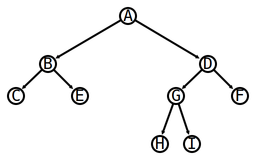
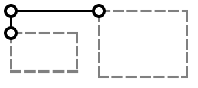
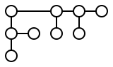

# Projekt rysowania drzew

## Cel

Napisać program w języku C, który dla danej dodatniej nieparzystej liczby całkowitej _n_, utworzy losowe drzewo binarne składające się z _n_ wierzchołków, a następnie utworzy rysunek tego drzewa w formacie SVG (ang. Scalable Vector Graphics).

### Podstawowe definicje

_Drzewo binarne_ może składać się z jednego wierzchołka nazywanego _liściem_ lub być zdefiniowane rekurencyjnie za pomocą trójki (&nbsp;_korzeń_, _lewe_, _prawe_&nbsp;), gdzie korzeń jest wierzchołkiem, a lewe i prawe to dwa drzewa binarne.

Na przykład (_A_, (_B_, _C_, _E_), (_D_, (_G_, _H_, _I_), _F_)) jest drzewem binarnym, które łatwo sobie wyobrazić jako następującą strukturę hierarchiczną:

Wierzchołek _A_ jest korzeniem całego drzewa; jego liśćmi są wierzchołki: _C_, _E_, _F_, _H_ i _I_.

### Algorytm tworzenia losowego drzewa dla zbioru liczb {1,...,n}

1. Jeśli wejściowy zbiór składa się z jednej liczby, {&nbsp;_j_&nbsp;}, utwórz liść _j_ i zwróć go jako drzewo. W przeciwnym razie idź do punktu 2.
2. W wejściowym zbiorze {&nbsp;_i_ ,..., _j_ ,... ,_k_&nbsp;} wyznacz losowo element środkowy _j_ w taki sposób, aby w obydwu zbiorach: _z_1 = {&nbsp;_i_ ,..., _j_-1&nbsp;} i _z_2 = {&nbsp;_j_+1 ,..., _k_&nbsp;} była nieparzysta liczba elementów.
3. Stwórz drzewo _lewe_ idąc do punktu 1. ze zbiorem _z_1 i stwórz drzewo _prawe_ idąc do punktu 1. ze zbiorem _z_2.
4. Zwróć drzewo (&nbsp;_j_, _lewe_, _prawe_&nbsp;).

### Algorytm rysowania drzewa binarnego (j, lewe, prawe)

W algorytmie tym zakładamy, że każdy wierzchołek wejściowego drzewa będzie reprezentowany za pomocą małego okręgu, natomiast połączenie korzenia z lewym i prawym poddrzewem będzie reprezentowane za pomocą poziomego lub pionowego odcinka. Cały rysunek zostanie umieszczony w układzie współrzędnych kartezjańskich. Można przyjąć, że współrzędne (&nbsp;_x_, _y_&nbsp;) środka każdego okręgu reprezentującego wierzchołek są liczbami całkowitymi.

Główną ideę tego algorytmu ilustruje poniższy rysunek:

Wskazuje on, że większe poddrzewo (w sensie większej liczby wierzchołków) rysowane jest z prawej strony mniejszego poddrzewa.

Sam algorytm może być sformułowany w postaci prostej trójpunktowej procedury:

1. Rekursywnie skonstruuj rysunki lewego i prawego poddrzewa wejściowego drzewa.
2. Zgodnie z powyższym rysunkiem, korzeń umieść w punkcie (&nbsp;_x_, _y_&nbsp;), mniejsze poddrzewo umieść w prostokącie, którego lewy górny róg znajduje się w punkcie (&nbsp;_x_, _y_-1&nbsp;), natomiast większe poddrzewo umieść w prostokącie, którego lewy górny róg znajduje się w punkcie (&nbsp;_x_+_w_+1, _y_&nbsp;), gdzie _w_ jest szerokością rysunku mniejszego poddrzewa.
3. Narysuj odcinek pionowy łączący korzeń drzewa umieszczony w punkcie (&nbsp;_x_, _y_&nbsp;) z korzeniem poddrzewa umieszczonym w punkcie (&nbsp;_x_, _y_-1&nbsp;) oraz narysuj odcinek poziomy łączący korzeń drzewa umieszczony w punkcie (&nbsp;_x_, _y_&nbsp;) z korzeniem poddrzewa umieszczonym w punkcie (&nbsp;_x_+_w_+1, _y_&nbsp;).
 
Na przykład dla drzewa (4, (2, 1, 3), (8, (6, 5, 7), 9)) właściwym rysunkiem jest:

## Warunki zaliczenia

Napisać program konsolowy w języku C, który odczytuje dodatnią liczbę nieparzystą, tworzy wg powyższego (pierwszego) algorytmu losowe drzewo binarne, a następnie zapisuje je w pliku dowolna_nazwa.svg korzystając z drugiego algorytmu. Można wykorzystać dowolną bibliotekę dostępną dla języka C. Program ma działać pod kontrolą systemu operacyjnego Linux lub Windows. Jako rozwiązanie przesyłamy plik źródłowy naszego programu, instrukcję jak go kompilować i skąd pobrać potrzebne biblioteki. 
