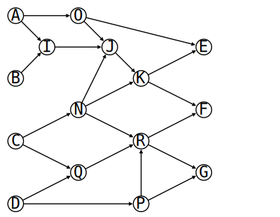

# Projekt programistyczny 11-18 stycznia 2026 r.

## Pojęcia podstawowe

**Graf** skierowany *G* składa się z dwóch zbiorów: *V* oraz *E*, przy czym *V*
jest niepustym skończonym zbiorem, którego elementy nazywane są wierzchołkami, a *E* zbiorem par wierzchołków zwanych krawędziami.

**Ścieżką** w grafie skierowanym będziemy nazywali ciąg parami różnych wierzchołków _v_<sub>1</sub>, _v_<sub>2</sub>,..., _v_<sub>k</sub>, w którym każde dwa kolejne wierzchołki tworzą krawędź (tzn. (_v_<sub>1</sub>, _v_<sub>2</sub>) jest krawędzią, (_v_<sub>2</sub>, _v_<sub>3</sub>) jest krawędzią itd.).

Graf skierowany jest acykliczny, jeśli z każdego wierzchołka można dotrzeć do innego wierzchołka tylko jednym sposobem lub wcale (acykliczność, brak możliwości chodzenia „w kółko”).

## Przykład

Na poniższym rysunku:



przedstawiono graf skierowany acykliczny *G* = (*V*, *E*), gdzie *V* = {A, B, C, D, E, F, G, I, J, K, N, O, P, Q, R}, a *E* = {(A, I), (A, O), (B, I), (C, N), (C, Q), (D, Q), (D, P), (I, J), (N, J), (N, K), (O, E), (O, J), (P, G), (P, R), (Q, R), (R, F), (R, G), (J, K), (K, E), (K, F)}.

Takie wierzchołki jak A, B, C i D, do których nie wchodzą żadne krawędzie, nazywane będą zbiorem **Input** (wejścia układu). Z kolei wierzchołki, z których nie wychodzą żadne krawędzie, takie jak E, F i G, nazywane będą zbiorem **Output** (wyjścia układu).

## Format danych wejściowych i wyjściowych

Na wejściu dostajemy graf skierowany acykliczny, którego wierzchołki oznaczono unikalnymi łańcuchami, zapisany w formacie JSON. Dla grafu z powyższego rysunku mielibyśmy:
```txt
{
   "Name": "Net01",
   "Vertices": ["A", "B", "C", "D", "E", "F", "G", "I", "J", "K", "N", "O", "P", "Q", "R"],
   "Input": ["A", "B", "C", "D"],
   "Output": ["E", "F", "G"],
   "Edges": {
      "A": ["O", "I"],
      "B": ["I"],
      "C": ["N", "Q"],
      "D": ["P", "Q"],
      "I": ["J"],
      "J": ["K"],
      "K": ["E", "F"],
      "N": ["J", "K"],
      "O": ["E", "J"],
      "P": ["G", "R"],
      "Q": ["R"],
      "R": ["F", "G"]
   }
}
```

Na wyjściu należy wypisać minimalny zbiór testów wykrywający każde potencjalne uszkodzenie układu (grafu) *G*. Testem jest para (*x*, *y*), gdzie *x* należy do zbioru **Input**, a *y* należy do zbioru **Output**. Zbiór testów *T* wykrywa każde potencjalne uszkodzenie, gdy dla każdego wierzchołka *v*, nie będącego wierzchołkiem wejściowym ani wyjściowym, istnieje w zbiorze *T* taka para (_u_<sub>1</sub>, _u_<sub>2</sub>), że *v* znajduje się na ścieżce biegnącej od _u_<sub>1</sub> do _u_<sub>2</sub> w grafie *G*.

Minimalnym zbiorem testów dla powyższego przykładowego grafu jest:
```txt
{ (A, E) (D, G) (C, F) }
```

Oznacza to, że nie da się znaleźć podobnego zbioru składającego się tylko z dwóch testów.

## Warunki zaliczenia

Napisać program konsolowy w języku C, który ze standardowego wejścia odczytuje dane (proszę przyjąć formatowanie wg powyższego przykładu,  czyli format wymiany danych JSON), a na standardowym wyjściu wypisuje rozwiązanie. Limit czasowy wynosi 3 sekundy.

Program może korzystać z dodatkowych (ogólnie dostępnych w Internecie) bibliotek pod warunkiem, że mamy dostęp do ich kodu źródłowego w języku C/C++. Jeśli program ma postać więcej niż jednego pliku, a w szczególności, gdy korzysta z dodatkowych bibliotek, to powinien być zorganizowany w projekt, który da się skompilować za pomocą ogólnie dostępnego narzędzia (`bazel`, `cmake`, `make`, `meson`, projekt MSBuild/Visual Studio itp. w zależności od systemu operacyjnego i polecanego kompilatora).

Programy będą oceniane na podstawie trzech grafów: 40-wierzchołkowego oraz do 200 krawędzi, 200-wierzchołkowego oraz do 1000 krawędzi, 500-wierzchołkowego oraz do 2000 krawędzi. Rozwiązanie w limicie czasowym pierwszego grafu daje ocenę dostateczną, drugiego – dobrą, trzeciego – bardzo dobrą.

Przykładowe dane testowe: [`g1.json`](https://w-wieczorek.github.io/cpp1-2/konkurs/g1.json), [`g2.json`](https://w-wieczorek.github.io/cpp1-2/konkurs/g2.json), [`g3.json`](https://w-wieczorek.github.io/cpp1-2/konkurs/g3.json).