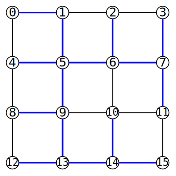

# Projekt programistyczny 48h

## Pojęcia podstawowe

**Graf** (nieskierowany) *G* składa się z dwóch zbiorów: *V* oraz *E*, przy czym *V*
jest niepustym skończonym zbiorem, którego elementy nazywane są wierzchołkami, a *E* jest rodziną dwuelementowych podzbiorów zbioru wierzchołków *V*, zwanych krawędziami.

**Drzewo** to graf, który jest acykliczny i spójny, czyli taki graf, w którym z każdego wierzchołka drzewa można dotrzeć do każdego innego wierzchołka (spójność) tylko jednym sposobem (acykliczność, brak możliwości chodzenia „w kółko”).

**Drzewo rozpinające** (ang. spanning tree) to drzewo, które zawiera wszystkie wierzchołki grafu *G*, zaś zbiór krawędzi drzewa jest podzbiorem zbioru krawędzi grafu.

**Stopniem wierzchołka** w grafie/drzewie nazywamy liczbę krawędzi, których ten wierzchołek jest końcem.

**Liściem drzewa** jest każdy wierzchołek o stopniu równym jeden.

Spośród wszystkich możliwych drzew rozpinających będzie nas interesowało takie, które ma najwięcej liści.

## Przykład

Na poniższym rysunku:



niebieskim kolorem zaznaczono krawędzie wchodzące w skład drzewa rozpinającego o możliwie największej liczbie liści równej 9.

## Format danych wejściowych i wyjściowych

Na wejściu dostajemy graf spójny, którego wierzchołki ponumerowano kolejnymi liczbami całkowitymi od zera rozpoczynając. W pierwszym wierszu znajdują się dwie liczby: liczba wierzchołków grafu i liczba krawędzi. W kolejnych wierszach każda krawędź opisana jest za pomocą dwóch wierzchołków. Dla grafu z powyższego rysunku mielibyśmy:
```txt
16 24
1 0
4 0
2 1
5 1
3 2
6 2
7 3
5 4
8 4
6 5
9 5
7 6
10 6
11 7
9 8
12 8
10 9
13 9
11 10
14 10
15 11
13 12
14 13
15 14
```

Na wyjściu należy wypisać optymalne drzewo, jak pokazano niżej:
```txt
Objective value: 9
Edge: 1 -- 0
Edge: 5 -- 1
Edge: 5 -- 4
Edge: 5 -- 6
Edge: 5 -- 9
Edge: 6 -- 2
Edge: 6 -- 7
Edge: 7 -- 3
Edge: 7 -- 11
Edge: 9 -- 8
Edge: 9 -- 13
Edge: 13 -- 12
Edge: 13 -- 14
Edge: 14 -- 10
Edge: 14 -- 15
```

## Warunki zaliczenia

Napisać program konsolowy w języku C/C++, który ze standardowego wejścia odczytuje dane (proszę przyjąć formatowanie wg powyższego przykładu), a na standardowym wyjściu wypisuje rozwiązanie. Limit czasowy wynosi 10 sekund.

Program może korzystać z dodatkowych (ogólnie dostępnych w Internecie) bibliotek. Jeśli program ma postać więcej niż jednego pliku, to powinien być zorganizowany w projekt, który da się skompilować za pomocą ogólnie dostępnego narzędzia (`bazel`, `cmake`, `make`, `meson`, projekt MSBuild/Visual Studio itp. w zależności od systemu operacyjnego i polecanego kompilatora).

Programy będą oceniane na podstawie trzech grafów: 8-wierzchołkowego oraz do 20 krawędzi, 16-wierzchołkowego oraz do 40 krawędzi, 30-wierzchołkowego oraz do 80 krawędzi. Rozwiązanie w limicie czasowym pierwszego grafu daje ocenę dostateczną, drugiego – dobrą, trzeciego – bardzo dobrą.

Przykładowe dane testowe: [`g8.txt`](https://w-wieczorek.github.io/cpp1-2/konkurs/g8.txt), [`g16.txt`](https://w-wieczorek.github.io/cpp1-2/konkurs/g16.txt), [`g30.txt`](https://w-wieczorek.github.io/cpp1-2/konkurs/g30.txt).