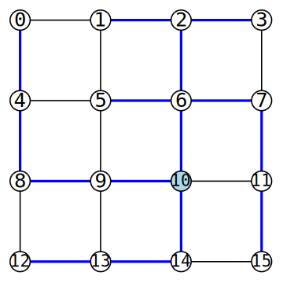

# Projekt programistyczny 48h

## Pojęcia podstawowe

**Graf** (nieskierowany) *G* składa się z dwóch zbiorów: *V* oraz *E*, przy czym *V*
jest niepustym skończonym zbiorem, którego elementy nazywane są wierzchołkami, a *E* jest rodziną dwuelementowych podzbiorów zbioru wierzchołków *V*, zwanych krawędziami.

**Drzewo** to graf, który jest acykliczny i spójny, czyli taki graf, w którym z każdego wierzchołka drzewa można dotrzeć do każdego innego wierzchołka (spójność) tylko jednym sposobem (acykliczność, brak możliwości chodzenia „w kółko”).

W wielu zastosowaniach w drzewie wyróżnia się jeden wierzchołek startowy zwany **korzeniem**.

**Drogą** w drzewie będziemy nazywali ciąg wierzchołków _v_<sub>1</sub>, _v_<sub>2</sub>,..., _v_<sub>k</sub>, w którym każde dwa kolejne wierzchołki są krawędzią (tzn. {_v_<sub>1</sub>, _v_<sub>2</sub>} jest krawędzią, {_v_<sub>2</sub>, _v_<sub>3</sub>} jest krawędzią itd.), jeśli ponadto wierzchołki _v_<sub>1</sub>, _v_<sub>2</sub>,..., _v_<sub>k</sub> są różne. **Długość** takiej drogi wynosi _k_-1.

**Wysokością** drzewa z korzeniem jest długość najdłuższej drogi biegnącej od korzenia do dowolnego wierzchołka.

**Drzewo rozpinające** (ang. spanning tree) to drzewo, które zawiera wszystkie wierzchołki grafu *G*, zaś zbiór krawędzi drzewa jest podzbiorem zbioru krawędzi grafu.

Spośród wszystkich możliwych drzew rozpinających będzie nas interesowało takie, które ma najmniejszą wysokość.

## Przykład

Na poniższym rysunku:



niebieskim kolorem zaznaczono korzeń oraz krawędzie wchodzące w skład drzewa rozpinającego o możliwie najmniejszej wysokości równej 4.

## Format danych wejściowych i wyjściowych

Na wejściu dostajemy graf spójny, którego wierzchołki ponumerowano kolejnymi liczbami całkowitymi od zera rozpoczynając. W pierwszym wierszu znajdują się dwie liczby: liczba wierzchołków grafu i liczba krawędzi. W kolejnych wierszach każda krawędź opisana jest za pomocą dwóch wierzchołków. Dla grafu z powyższego rysunku mielibyśmy:
```txt
16 24
1 0
4 0
2 1
5 1
3 2
6 2
7 3
5 4
8 4
6 5
9 5
7 6
10 6
11 7
9 8
12 8
10 9
13 9
11 10
14 10
15 11
13 12
14 13
15 14
```

Na wyjściu należy wypisać optymalne drzewo w postaci struktury hierarchicznej, jak pokazano niżej:
```txt
\- 10
   +- 6
   |  +- 2
   |  |  +- 1
   |  |  \- 3
   |  +- 5
   |  \- 7
   |     \- 11
   |        \- 15
   +- 9
   |  \- 8
   |     \- 4
   |        \- 0
   \- 14
      \- 13
         \- 12
```

## Warunki zaliczenia

Napisać program konsolowy w języku C/C++, który ze standardowego wejścia odczytuje dane (proszę przyjąć formatowanie wg powyższego przykładu), a na standardowym wyjściu wypisuje rozwiązanie. Limit czasowy wynosi 10 sekund.

Program może korzystać z dodatkowych (ogólnie dostępnych w Internecie) bibliotek pod warunkiem, że mamy dostęp do ich kodu źródłowego w języku C/C++. Jeśli program ma postać więcej niż jednego pliku, to powinien być zorganizowany w projekt, który da się skompilować za pomocą ogólnie dostępnego narzędzia (`dotnet build`, `make` itp. w zależności od systemu operacyjnego i polecanego kompilatora).

Programy będą oceniane na podstawie trzech grafów: 8-wierzchołkowego oraz do 30 krawędzi, 40-wierzchołkowego oraz do 200 krawędzi, 80-wierzchołkowego oraz do 500 krawędzi. Rozwiązanie w limicie czasowym pierwszego grafu daje ocenę dostateczną, drugiego – dobrą, trzeciego – bardzo dobrą.

Przykładowe dane testowe: [`g8.txt`](https://w-wieczorek.github.io/cpp1-2/konkurs/g8.txt), [`g50.txt`](https://w-wieczorek.github.io/cpp1-2/konkurs/g50.txt), [`g200.txt`](https://w-wieczorek.github.io/cpp1-2/konkurs/g200.txt).